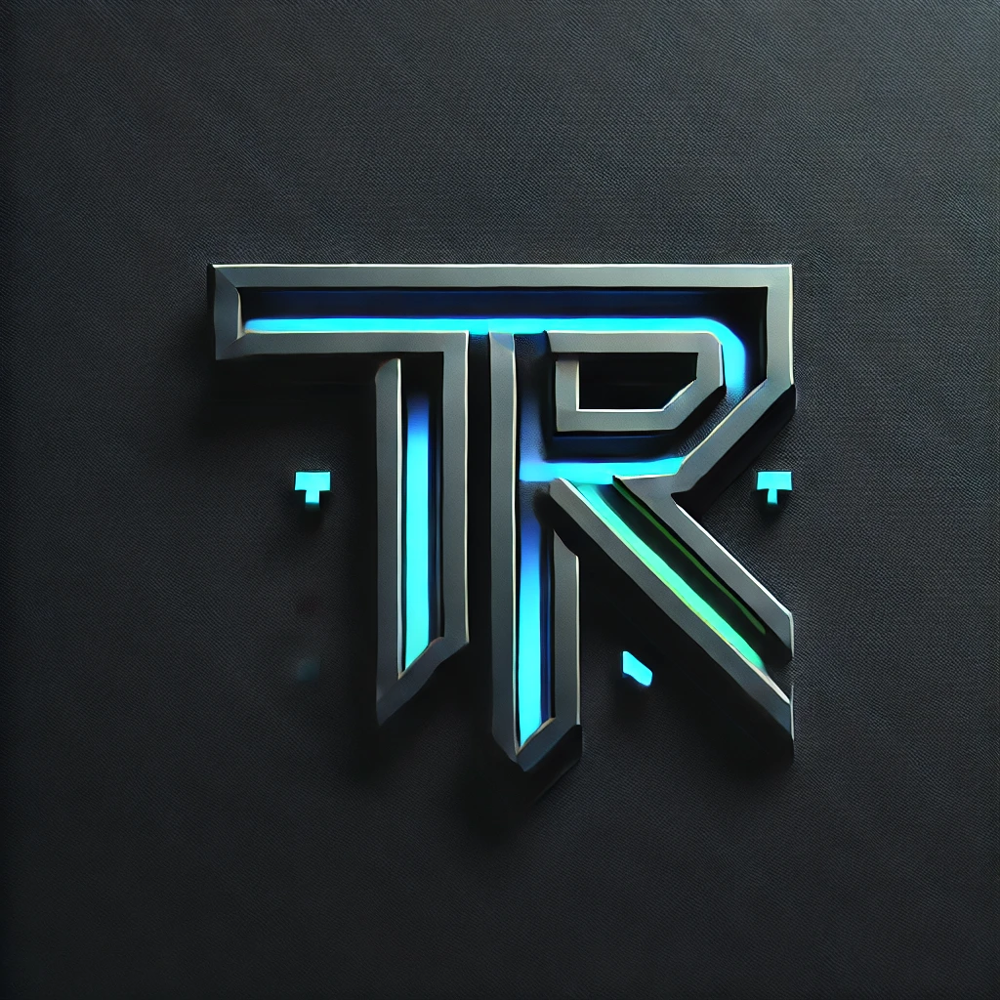

<!DOCTYPE html>
<html lang="fi">
<head>
    <meta charset="UTF-8">
    <meta name="viewport" content="width=device-width, initial-scale=1.0">
    <title>Portfolio - TR</title>
    
</head>
<body>
    

        <a href="#osaaminen">Osaaminen</a>
        <a href="#sijoittaminen">Sijoittaminen</a>
        <a href="#3d-tulostus">3D-tulostus</a>
        <a href="#portfolio">Portfolio</a>
    

    
    

        
        <h1 class="title">Tervetuloa Portfoliooni</h1>
    

    
    

        <h2>Osaaminen ja Kokemus</h2>
        
Toimin teknisenä asiantuntijana Danfoss Leanhetillä ulkoisena työntekijänä Academic Workin kautta. Työtehtäviini kuuluu tekninen tuki isännöinnille, huollolle ja asentajille, uusien kohteiden luominen sekä erilaiset integraatiot.

        
Koulutukseltani olen talotekniikan insinööri, ja minulla on 11 vuoden kokemus asennustöistä sekä 8 kuukautta kokemusta teknisenä asiantuntijana.

    

    
    

        <h2>Sijoittaminen ja Koodaus</h2>
        
Olen kiinnostunut vaurastumisesta ja sijoittamisesta, erityisesti korkeariskisistä sijoituksista ja isoista tuotoista. Keskityn sekä pitkäaikaiseen kryptosijoittamiseen että lyhyen aikavälin treidaamiseen.

        
Pidän koodauksesta ja mallintamisesta ja olen käyttänyt GitHubia omiin projekteihini.

    

    
    

        <h2>3D-tulostus</h2>
        
Omistan 3D-tulostimen ja tykkään käyttää sitä erilaisiin projekteihin.

    

    
    

        <h2>Portfolio</h2>
        
Haluan portfoliosivustoni olevan asiallinen, tekninen, visuaalinen ja moderni. Käytän tummaa, futuristista ja teknistä värimaailmaa sekä animaatioita ja graafisia elementtejä. Sivustolla on monikielisyys (suomi ja englanti) ja se on hostattu GitHub Pagesilla.

    

</body>
</html><!DOCTYPE html>
<html lang="fi">
<head>
    <meta charset="UTF-8">
    <meta name="viewport" content="width=device-width, initial-scale=1.0">
    <title>Portfolio - TR</title>
    
</head>
<body>
    

        
        <h1 class="title">Tervetuloa Portfoliooni</h1>
    

    
    

        <h2>Osaaminen ja Kokemus</h2>
        
Toimin teknisenä asiantuntijana Danfoss Leanhetillä ulkoisena työntekijänä Academic Workin kautta. Työtehtäviini kuuluu tekninen tuki isännöinnille, huollolle ja asentajille, uusien kohteiden luominen sekä erilaiset integraatiot.

        
Koulutukseltani olen talotekniikan insinööri, ja minulla on 11 vuoden kokemus asennustöistä sekä 8 kuukautta kokemusta teknisenä asiantuntijana.

        
        <h2>Sijoittaminen ja Koodaus</h2>
        
Olen kiinnostunut vaurastumisesta ja sijoittamisesta, erityisesti korkeariskisistä sijoituksista ja isoista tuotoista. Keskityn sekä pitkäaikaiseen kryptosijoittamiseen että lyhyen aikavälin treidaamiseen.

        
Pidän koodauksesta ja mallintamisesta ja olen käyttänyt GitHubia omiin projekteihini.

        
        <h2>3D-tulostus</h2>
        
Omistan 3D-tulostimen ja tykkään käyttää sitä erilaisiin projekteihin.

        
        <h2>Portfolio</h2>
        
Haluan portfoliosivustoni olevan asiallinen, tekninen, visuaalinen ja moderni. Käytän tummaa, futuristista ja teknistä värimaailmaa sekä animaatioita ja graafisia elementtejä. Sivustolla on monikielisyys (suomi ja englanti) ja se on hostattu GitHub Pagesilla.

    

</body>
</html>

    

        
        <h1 class="title">Tervetuloa Portfoliooni</h1>
    

</body>
</html>
